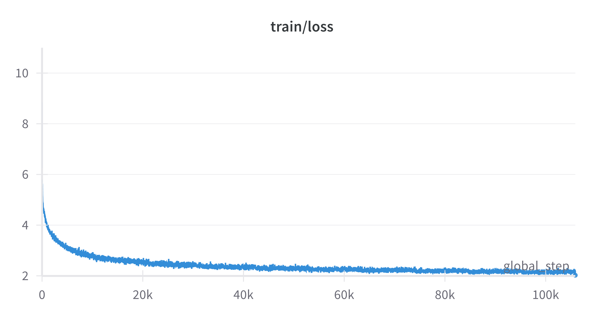

# Chapter 1: A Journey into the Heart of Transformers

_Note:_ Make sure to follow the instructions in the [README](../README.md) to install the dependencies.

## Overview

The goal of this chapter is to build a translation system, based on transformer architecture, that is capable of translating from English to Hindi. To achieve this goal we shall implement, the paper - [Attention is all you need](./01_attention_is_all_you_need.pdf)

## Folder Structure

- `ch1/`
  - `components/` - Components of the transformer model (encoder, decoder, attention, etc.)
  - `dataset.py` - Dataset class for loading and preprocessing the data
  - `train.py` - Training script
  - `inference.py` - Inference script
  - `utils.py` - Utility functions

## Training

You can either train the model from scratch or use pre-trained weights from [Hugging Face](https://huggingface.co/s1lv3rj1nx/ch1). To train the model from scratch, run the following command:

```bash
python train.py
```

If you want to use pre-trained weights, download the weights from [Hugging Face](https://huggingface.co/s1lv3rj1nx/ch1) and place them in the `ch1/runs/weights` directory. Specifically, you can download `tmodel_09.pt` from the repo and place it in the `ch1/runs/weights` directory.

The loss curve post training is shown in the figure below.



## Inference

To do inference, run the following command:

```bash
python inference.py
```

Sample outputs are shown below:

```
Enter English text: india must work for it's independence
Hindi translation: इंडिया को इसकी आजादी के लिए काम करना चाहिए

Enter English text: i love my country
Hindi translation: मेरे देश से प्यार करते हैं

Enter English text: prime minister modi is giving grants for space programs
Hindi translation: प्रधानमंत्री मोदी अंतरिक्ष कार्यक्रमों के लिए अनुदान दे रहे हैं

Enter English text: People are sad and angry.
Hindi translation: लोगों में दुख और गुस्सा है।
```

## Citation

```
@article{vaswani2017attention,
  title={Attention is all you need},
  author={Vaswani, A},
  journal={Advances in Neural Information Processing Systems},
  year={2017}
}
```
